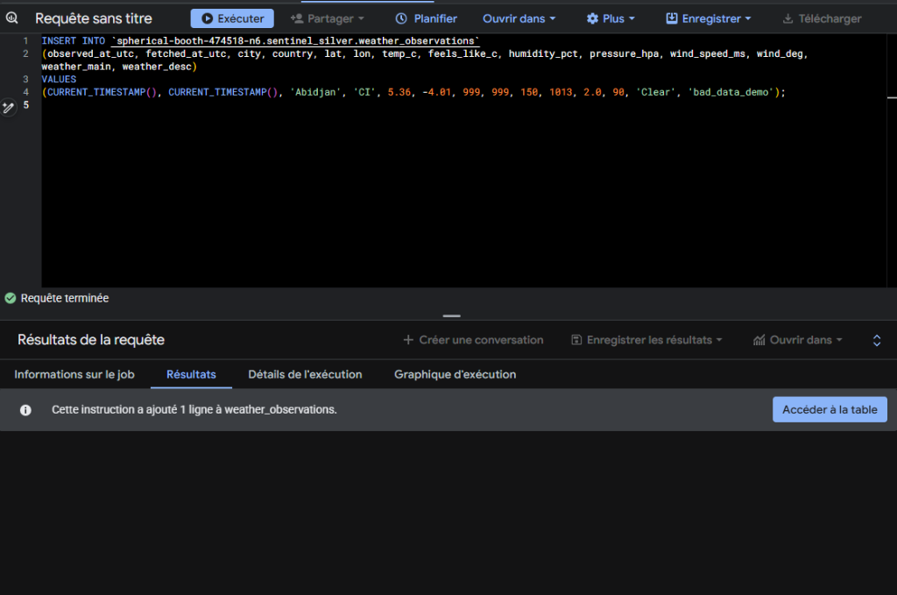
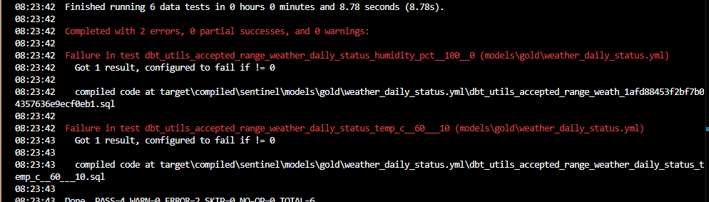
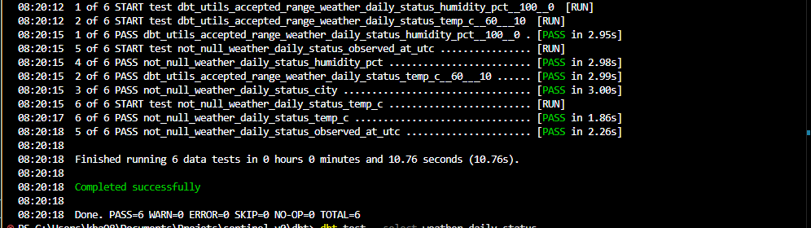
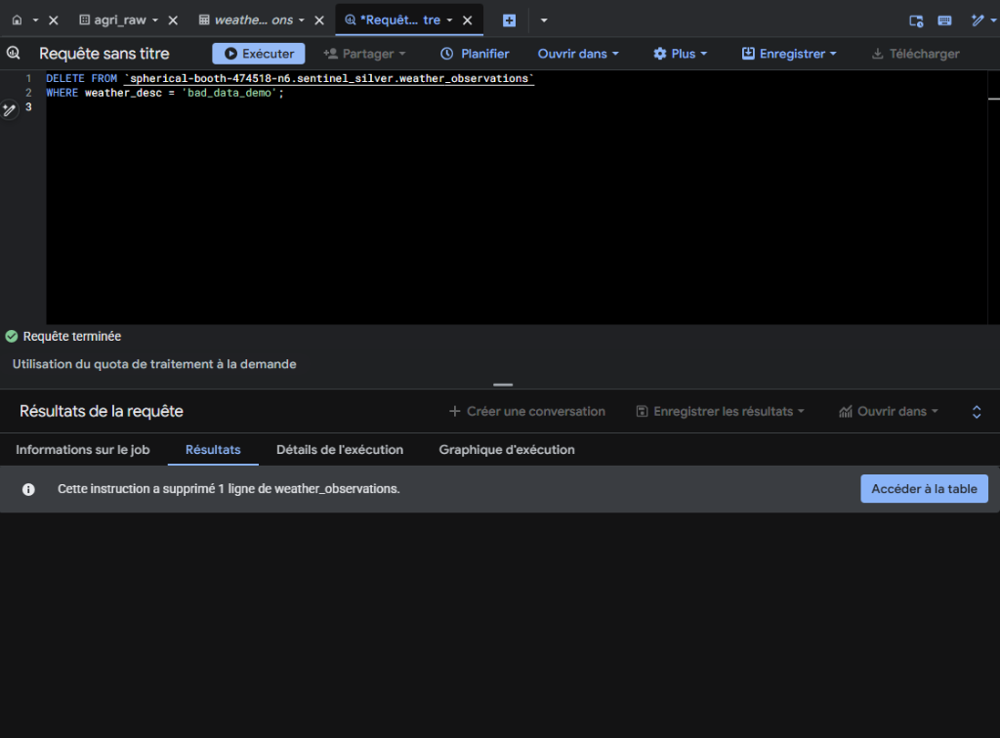
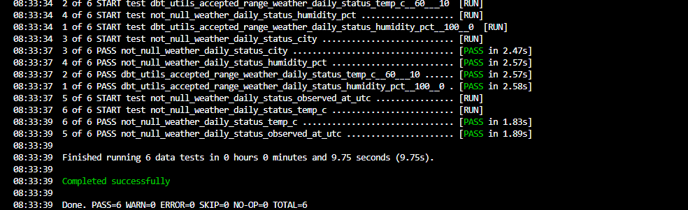

<<<<<<< HEAD
# sentinel-V0
=======
# Sentinel v0

## 1. Objectif du projet
Pipeline de données robuste pour l'ingestion et la transformation de données (ex: météo, agriculture).

## 2. Architecture (Medallion)
- **Bronze**: Données brutes (JSON) stockées sur GCS.
- **Silver**: Données nettoyées et structurées (BigQuery/GCS).
- **Gold**: Données agrégées prêtes pour l'analyse.

## 3. Stack technique
- **Orchestration**: Prefect
- **Transformation**: dbt
- **Stockage**: Google Cloud Storage (GCS) & BigQuery
- **Langage**: Python 3.10+

## 4. Structure du projet
```
sentinel-v0/
├── flows/          # Scripts Prefect
├── dbt/            # Projets dbt (models, seeds, tests)
├── infra/          # Documentation infra
└── requirements.txt
```

## 5. Scénario réel observé (Projet Sentinel)
**Cas testé : API key invalide sur ingestion météo**

Dans le cadre du développement de Sentinel, nous avons simulé une panne d'authentification API pour valider la robustesse du pipeline :

1. **Comportement Automatique** :
    - Le flow Prefect détecte l'erreur 401 (Unauthorized).
    - Il déclenche les **retries** configurés (3 tentatives espacées de 10s, 30s, 90s).
    - Aucune donnée partielle n'est envoyée vers le stockage.

2. **Résultat** :
    - **Arrêt propre** ("Fail Fast") du flow après échec des retries.
    - Notification d'erreur dans les logs.

3. **Impact Business & Technique** :
   - 🛡️ **Bronze (Sécurité)** : Aucun fichier corrompu ou vide n'a été créé (`sentinel-bronze` reste propre).
   - 💎 **Gold (Stabilité)** : Les tableaux de bord et analyses continuent de fonctionner sur les données historiques (J-1), sans risque de régression ou de "trous" dans les données du jour.

## 6. Commandes de run

### Bronze
```bash
python flows/ingest_weather_to_bronze.py
```

### Silver
```bash
python flows/load_weather_bronze_to_silver.py
```

### Gold + tests
```bash
cd dbt
dbt run --select weather_daily_status
dbt test --select weather_daily_status
```

## 7. Scénario KO (Preuve Sentinel)

**But** : démontrer que Sentinel bloque la donnée aberrante.

### Inject bad data (KO)
```sql
INSERT INTO `spherical-booth-474518-n6.sentinel_silver.weather_observations`
(observed_at_utc, fetched_at_utc, city, country, lat, lon, temp_c, feels_like_c, humidity_pct, pressure_hpa, wind_speed_ms, wind_deg, weather_main, weather_desc)
VALUES
(CURRENT_TIMESTAMP(), CURRENT_TIMESTAMP(), 'Abidjan', 'CI', 5.36, -4.01, 999, 999, 150, 1013, 2.0, 90, 'Clear', 'bad_data_demo');
```

### Puis :
```bash
dbt test --select weather_daily_status
# Attendu: FAIL sur accepted_range temp_c & humidity_pct
```

### Rollback :
```sql
DELETE FROM `spherical-booth-474518-n6.sentinel_silver.weather_observations`
WHERE weather_desc = 'bad_data_demo';
```

### Galerie des Preuves








## 8. Interprétation “Sentinel”

**KO** = tests dbt échouent → données suspectes détectées

**Protection** = pas de “corruption silencieuse” (tu vois l’échec)
>>>>>>> 50c1089 (V0 complete: Prefect deployment scheduled + Bronze/Silver/Gold pipeline stable)
